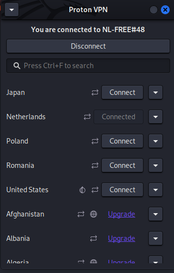

# Task 8 – Working with VPNs

## Objective
The objective of this task is to explore the concept of Virtual Private Networks (VPNs) by installing ProtonVPN on Kali Linux, connecting to a secure server, and verifying the change in public IP address before and after the VPN connection.

---

## Tools Used
- **ProtonVPN (Linux GUI Client)** – For establishing a secure VPN connection.
- **WhatIsMyIPAddress.com** – To check the public IP before and after connecting to the VPN.

---

## Steps Performed

### 1. Checking IP Address Before Connecting to VPN
Before connecting to a VPN, the current public IP address was noted.

---

### 2. Connecting to ProtonVPN
ProtonVPN was launched, and a connection was established to a Netherlands server.

---

### 3. Checking IP Address After Connecting to VPN
Once connected, the public IP was checked again to confirm the change, showing the VPN’s server location instead of the original ISP.

---

## Observations
- The IP address changed after connecting to the VPN, indicating successful tunneling of network traffic.
- The VPN masked the real IP and location, replacing it with the server’s IP and location.

---

## Benefits of Using VPNs
- **Privacy Protection** – Hides your real IP address from websites and trackers.
- **Data Encryption** – Secures internet traffic from interception.
- **Bypassing Geo-Restrictions** – Access region-specific content.
- **Protection on Public Wi-Fi** – Prevents data theft when using open networks.

---

**🔹 Author:** Mohammad Farhan Hussain
**🔹 Internship:** Elevate Labs Cybersecurity Internship
**🔹 Tools:** Proton VPN, whatismyip

